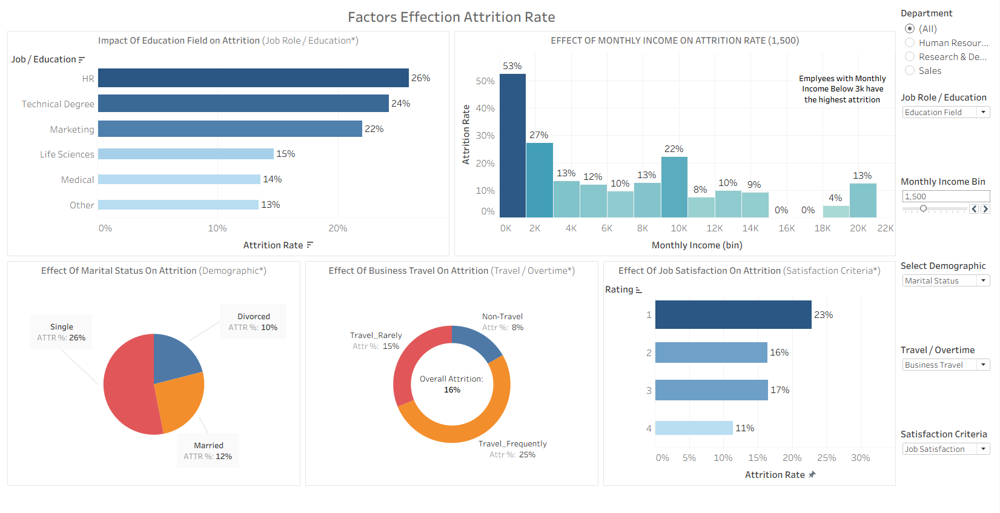

# Employee-Attrition-Dashboard-Tableau

The project presents an interactive Tableau dashboard designed to analyse employee attrition trends based on multiple factors.

---

## 📖 Project Overview

Employee attrition is a critical challenge for organizations because it increases recruitment costs, reduces productivity, and affects organizational stability. Understanding the drivers behind employee turnover helps HR teams design better retention strategies.

This project presents an interactive Tableau dashboard that analyzes employee attrition using multiple demographic, financial, and job-related factors. The dashboard allows users to explore attrition trends through interactive parameters and filters.

The goal of this project is to identify the key factors influencing employee attrition and provide actionable insights for HR decision-making.

---

## 📂 Dataset

The dataset used in this project is the IBM HR Employee Attrition dataset, which contains detailed employee records including demographics, salary information, job satisfaction, and work conditions.

**Key Attributes**

| **Category**            | **Variables**                                                |
|-------------------------|--------------------------------------------------------------|
| Employee Information    | Age, Department, Job Role                                   |
| Compensation            | Monthly Income, Salary Hike                                 |
| Demographics            | Marital Status, Education Field                             |
| Job Factors             | Business Travel, Job Level, Work Life Balance, Companies Worked |
| Satisfaction Metrics    | Job Satisfaction, Years Since Last Promotion                |
| Target Variable         | Attrition (Yes / No)                                        |

---

## 📊 Dashboard Features

The Tableau dashboard explores multiple dimensions of employee attrition.

<p align="center">  </p>

1️⃣ **Education Field / Job Role vs Attrition**

The  visualization compares attrition rates across different education backgrounds and Job roles (We can switch between Education field or Job role using the drop down).

**Insights**

- Employees from HR and Technical Degree backgrounds show higher attrition rates
- Life Sciences and Medical fields show relatively lower attrition.
- Sales Rep and lab Tech job roles show the highest attrition rates.

2️⃣ **Monthly Income vs Attrition**

The visualization analyzes attrition rates across income bins (Bin size can be altered using the bin parameter)

**Insights**

- Employees earning below $3000/month have the highest attrition (approx 53%).
- Attrition gradually decreases as salary increases, indicating compensation is a major retention factor.

3️⃣ **Marital Status vs Attrition**

This visualization highlights attrition across different marital groups.

**Insights**

- Single employees: Highest attrition (~26%)
- Married employees: Lower attrition (~12%)
- Divorced employees: Lowest attrition (~10%)

This suggests personal stability may influence employee retention.

4️⃣ **Travel / Overtime Impact**

The visualization examines the relationship between travel frequency / overtime and attrition (We can switch between the variables using the filters).

**Insight**

- Highest attrition is observed in employees who have to travel frequently (25%). 
- The employees who work overtime have an attrition rate of 31%.

Overtime and travel frequency has a direct effect on attrition among employees.

5️⃣ **Job Satisfaction vs Attrition**

This visualization analyzes attrition across work life balance ratings.

**Insight**

- Employees who rated 1 in work life balance show a high attrition of 31%. This ties up with the analysis in point number 4 that working conditions play a crucial part in employee retention.

---

## ⚙️ Tableau Features Used

**🔹 Parameters**

Several parameters were implemented to make the dashboard interactive:

| **Parameter**          | **Purpose**                                           |
|------------------------|--------------------------------------------------------|
| Job Role / Education   | Switch between job role and education analysis         |
| Select Demographic     | Choose demographic factor (e.g., Marital Status)       |
| Satisfaction Criteria  | Select satisfaction metric                             |
| Travel / Overtime      | Choose work condition factor                           |
| Monthly Income Bin     | Adjust salary grouping                                 |

These parameters allow users to dynamically change the analysis perspective. These parameters also change the heading of the visuals as well accordingly.

**🔹 Calculated Fields**

Custom calculated fields were used to compute:

- Attrition Rate
- Dynamic binning of income and age
- Parameter-driven dimension selection
- Conditional filters

Example calculation:

Attrition Rate =
SUM([Attrition Flag]) / COUNT([Employee ID])

**🔹 Binning Techniques**

Several bin fields were created for better visualization:

- Monthly Income Bin
- Age Bin
- Salary Hike Bin
- Total Working Years grouping

Binning helps reveal patterns that may not be visible with raw values.

**🎛 Interactive Filters**

The dashboard includes filters for:

- Department
- Demographic selection
- Business travel
- satisfaction criteria
- Income bins

These filters allow users to explore attrition patterns across different employee segments.

---

## 📂Repository Structure

```
Employee-Attrition-Dashboard-Tableau/
│
├── datasets/                                                 # Raw dataset used for the project 
│
├── docs/                                                     # Project Files
│      ├── dashboard                                          # DDashboard Folder
│                ├── Employee_Attrition_Dashboard.twbx        # TWBX file
│      ├── screenshots                                        # Folder for Screenshots
│                ├── Employee_Attrition_Dashboard.png         # Dashboard screenshots
│
├── README.md                                                 # Project overview 

```

---
